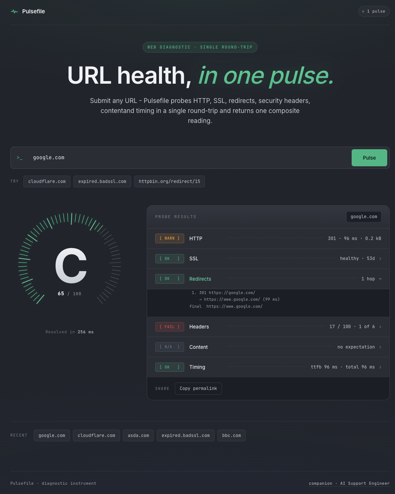

# 🩶 Pulsefile

One-shot URL health snapshots with composite scoring and SSRF defence.

[](https://github.com/Cash-Codes/Pulsefile/actions/workflows/ci.yml)


[](#)


## 🚀 Live Demo

👉 https://pulsefile-306383644133.us-central1.run.app/

## ✨ Features

- One-shot URL inspection - HTTP, SSL, redirects, security headers, content match, timing
- Composite 0-100 score with letter grade A-F
- Hardened SSRF guard with DNS pinning (closes the rebind window)
- Per-IP token-bucket rate limiting with `Retry-After` headers
- Single-container deploy on Cloud Run

## 🖼️ Screenshots



## 🧠 Tech Stack

- React 18 + TypeScript (Vite)
- Hono on Node 22
- undici for the network captures (with DNS-pinned `Agent`)
- Pino structured logging
- Vitest
- Multi-stage Docker on `node:22-slim`
- Cloud Run + Artifact Registry

The user pastes any URL into the console input. Pulsefile validates and pins it through the SSRF guard, runs three network captures in parallel (HTTP base fetch, TLS connect, redirect trace), derives six probe outcomes from those captures, and returns a single dense `PulseReport` with a composite score and letter grade. Failed probes return a typed `error` outcome rather than throwing - every report has all six entries.

## Architecture

Single TypeScript package, split by responsibility:

```
src/
  client/    React 18 SPA (Vite, port 5175)
  server/    Hono on Node 22 (tsx watch, port 8787)
  checks/    Six probe implementations + composite scorer
  shared/    PulseReport types shared across client and server
```

**Frontend** (`src/client/`):

| Module          | Responsibility                                                                  |
| --------------- | ------------------------------------------------------------------------------- |
| `App`           | Top-level layout - masthead, console, gauge + panel result, recents, share     |
| `PulseInput`    | URL input with normalization (auto-prepends `https://`), suggestion chips       |
| `ScoreCircle`   | 60-tick instrument gauge with animated sweep on result                          |
| `CheckTile`     | Terminal-style row with leader dots; expandable detail per check                |
| `RecentChecks`  | Last 5 URLs persisted in `localStorage`                                         |

**Backend** (`src/server/`):

| Module                    | Responsibility                                                                |
| ------------------------- | ----------------------------------------------------------------------------- |
| `index.ts`                | `buildApp` factory - rate limit + health route + pulse route + static SPA     |
| `routes/pulse.ts`         | `POST /api/pulse` - zod validation, error mapping, request-scoped logging     |
| `routes/health.ts`        | `GET /health` - sha + uptime                                                  |
| `orchestrator.ts`         | `runPulse` - three captures in parallel, six checks derived                   |
| `ssrfGuard.ts`            | URL validation + DNS pinning + multi-address rebind defence                   |
| `rateLimit.ts`             | Per-IP token bucket middleware                                                |
| `network/baseFetch.ts`    | undici fetch with pinned `Agent` + body cap                                   |
| `network/tlsConnect.ts`   | `tls.connect` + X.509 cert parsing                                            |
| `logger.ts`               | Pino structured logging                                                       |

**Probes** (`src/checks/`):

| Module                          | Responsibility                                                          |
| ------------------------------- | ----------------------------------------------------------------------- |
| `runHttpCheck`                  | HTTP status classification (`ok`/`warn`/`fail`)                         |
| `matchContent`                  | Optional substring match against the response body                      |
| `auditSecurityHeaders`          | Six canonical headers → 0-100 sub-score                                |
| `timingBreakdown`               | TTFB + total latency passthrough                                       |
| `inspectTls` + `sslExpiry`      | TLS classification (`healthy` / `expiring_soon` / `expired`)            |
| `traceRedirects`                | Manual redirect chain with per-hop SSRF re-check                        |
| `score`                         | Weighted composite (HTTP 30, SSL 25, headers 20, redirects 10, …) → A-F |

**Request flow:**

```
Browser → POST /api/pulse
  → rateLimit (per-IP token bucket; 429 + Retry-After if exhausted)
  → zod validate { url, expect? }
  → runPulse:
      → validateAndPin (SSRF guard with DNS-pin)
      → Promise.allSettled([baseFetch, tlsConnect, traceRedirects])
      → derive: HTTP, content, headers, timing, SSL, redirects
      → computeCompositeScore → 0-100 + letter grade
  → JSON PulseReport → diagnostic UI renders
```

## API

`POST /api/pulse`

Request: `{ "url": "https://example.com", "expect": "optional substring" }`

Response (200): a single `PulseReport`:

```jsonc
{
  "requestedUrl": "https://www.cloudflare.com",
  "resolvedAt":   "2026-04-30T18:31:25.351Z",
  "durationMs":   502,
  "composite":    { "scoreOutOf100": 100, "grade": "A" },
  "checks": {
    "http":            { "status": "ok",   "httpStatus": 200, "latencyMs": 396, "responseSizeBytes": 981926 },
    "ssl":             { "status": "ok",   "classification": "healthy", "daysUntilExpiry": 87, /* ... */ },
    "redirects":       { "status": "ok",   "hops": [], "finalUrl": "...", "capped": false },
    "securityHeaders": { "status": "ok",   "scoreOutOf100": 83, "headers": [/* ... */] },
    "content":         { "status": "na",   "expected": null, "matched": false },
    "timing":          { "status": "ok",   "ttfbMs": 80, "totalMs": 502, /* ... */ }
  }
}
```

Errors map to specific shapes:

- **400** `invalid_url` - bad scheme, malformed URL, or DNS lookup failed (the user almost certainly has a typo)
- **400** `ssrf_blocked` - URL resolves to a private / loopback / CGNAT / multicast IP
- **429** `rate_limited` - too many pulses from your address; `Retry-After` header indicates seconds
- **500** `internal_error` - unexpected failure

`GET /health` returns `{ "ok": true, "sha": "<build-sha>", "uptime_s": <int> }`.

## 🤖 AI Integration

Pulsefile is a portfolio companion to the [AI Support Engineer](https://github.com/cash-codes/AI_support_engineer) agent. The landing page embeds the agent's chat widget, `docs/` is structured as a RAG corpus the agent retrieves over, and a small number of subtle bugs are planted in `src/checks/` so the agent's code-investigation step has something genuine to find during demos.

This ensures:

- A realistic product host for the agent (not another todo-app demo)
- Honest demo arcs - the agent surfaces real findings from real code

## Setup

### 1. Install dependencies

```bash
pnpm install
```

### 2. Run dev servers

```bash
pnpm dev
```

Frontend: http://localhost:5175  
API: http://localhost:8787

(Production listens on `:8080`; the dev server uses `:8787` to avoid colliding with the AI Support Engineer's local widget host on `:8080`.)

### 3. (Optional) Run the AI Support Engineer alongside

The landing page embeds a widget loader pointing at `localhost:8080`. To wire up the chat end-to-end, run the AI Support Engineer with `PRODUCT_REPO_PATH=/path/to/pulsefile`.

### 4. Build a container

```bash
pnpm build
docker build --build-arg BUILD_SHA=$(date +%Y%m%d-%H%M%S) -t pulsefile:local .
docker run --rm -p 8080:8080 pulsefile:local
```

See [`docs/deployment.md`](docs/deployment.md) for Cloud Run deploy steps.

## Testing

Tests use [Vitest](https://vitest.dev/).

```bash
# Run all tests (probe stack + routes + middleware)
pnpm test

# Watch mode
pnpm test:watch

# Type-check only
pnpm typecheck
```

GitHub Actions runs install / typecheck / test / build on every push, plus a separate Docker-build job (see `.github/workflows/ci.yml`).

## Environment variables

| Variable               | Default | Description                                                                |
| ---------------------- | ------- | -------------------------------------------------------------------------- |
| `PORT`                 | `8080`  | Hono listen port                                                           |
| `LOG_LEVEL`            | `info`  | Pino log level                                                             |
| `MAX_REDIRECT_HOPS`    | `10`    | Cap for the redirect-chain probe                                           |
| `CHECK_TIMEOUT_MS`     | `4000`  | Per-probe timeout                                                          |
| `RATE_LIMIT_BURST`     | `10`    | Max in-flight pulses per IP before `429`                                   |
| `RATE_LIMIT_REFILL_MS` | `6000`  | Token refill interval (default ≈ 10 sustained pulses/min per IP)           |
| `BUILD_SHA`            | `dev`   | Surfaced via `/health` for revision tracking                               |
| `SERVE_CLIENT`         | -       | Set to `1` to serve the built SPA from the same process (Cloud Run)        |

## V1 trade-offs

**What was intentionally left out:**

- Authentication, accounts, persistent database
- Saved-report history (recents live in browser `localStorage` only)
- Scheduled monitoring or alerts - one-shot inspection only
- Per-phase DNS/TCP/TLS timing (currently `0`; documented in `docs/known-issues.md`)
- Multi-region probes - runs from a single Cloud Run region

**Why:** V1 targets the diagnostic-instrument experience - a working URL inspector with hardened SSRF defence, sensible rate limiting, and a polished UI, deployable to Cloud Run in a single container.

## Future (V2+)

- Per-phase timing via socket-level instrumentation (real DNS/TCP/TLS breakdown)
- Multi-region probe topology with regional aggregation
- Persistent report archive with shareable permalinks
- Public Suffix List validation for input (catch `google.comasd` client-side)
- Optional Lighthouse-style performance audit
- Webhook notifications when a watched URL changes grade
